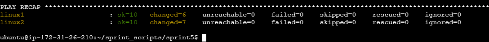
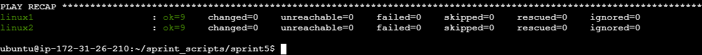
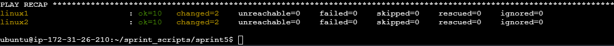
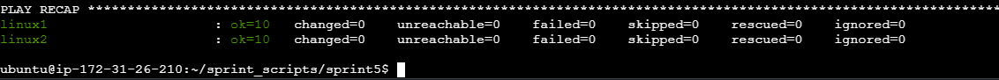

# Automated Healthmon Deployment with Ansible

## Project Overview

Sprint 5 takes the **HealthMon** system-health monitoring tool built in Sprint 4
and automates its provisioning and deployment across multiple AWS Linux servers
using **Ansible**. Instead of configuring each host by hand, one server doubles
as the Ansible control node - configuring itself locally and a second server
over SSH - through two idempotent playbooks:

- **`configure.yml`** - prepares a fresh server for production (packages, a
  dedicated service account, timezone, SSH hardening, and logging).
- **`deploy.yml`** - deploys the Sprint 4 monitoring scripts, installs their
  Python dependencies, sets permissions, and schedules them via cron.

Running the same playbook twice produces changes only on the first run and
**zero changes** on the second, demonstrating full idempotency.

## Architecture

```text
   +------------------------------------+
   |   Server 1  (172.31.26.210)        |
   |   "linux1" - Control Node          |
   |   - Ansible installed              |
   |   - inventory.ini                  |
   |   - configure.yml / deploy.yml     |
   |   - HealthMon + cron schedule      |
   |     (managed locally)              |
   +------------------+-----------------+
                      | Key-Based SSH
                      v
   +------------------------------------+
   |   Server 2  (172.31.26.22)         |
   |   "linux2" - Managed Target        |
   |   - HealthMon + cron schedule      |
   +------------------------------------+
```

- **Server 1 (`linux1`, 172.31.26.210)** - the control node where Ansible is
  installed, holding the playbooks and inventory. It also manages *itself* as a
  target via `ansible_connection=local`, receiving the full configuration and
  HealthMon deployment.
- **Server 2 (`linux2`, 172.31.26.22)** - a remote managed target. Server 1
  connects to it over SSH using a private key (`ansible_user=ubuntu`).
- Both hosts belong to the `servers` group, so every play targets Server 1
  (locally) and Server 2 (over SSH) at once.

## Files

| File            | Purpose                                                                 |
|-----------------|-------------------------------------------------------------------------|
| `inventory.ini` | Defines the `servers` group, host IPs, and the SSH connection user.     |
| `configure.yml` | Baseline server hardening and preparation playbook.                     |
| `deploy.yml`    | Deploys the HealthMon scripts, dependencies, and cron schedule.         |
| `README.md`     | This document.                                                          |

The Sprint 4 source files (`healthmon.py`, `config.json`) are read from the
neighboring `../sprint4/` directory by `deploy.yml` via the `source_dir`
variable.

## Prerequisites

- **Ansible** installed on the control node (`ansible --version`), including the
  `community.general` collection used by the `timezone` module:
  ```bash
  ansible-galaxy collection install community.general
  ```
- **SSH key access** from the control node (Server 1) to the remote Server 2.
  Server 1 manages itself over a local connection. Verify both with:
  ```bash
  ansible all -i inventory.ini -m ping
  ```
- **Python 3** present on the managed hosts (default on Ubuntu/Amazon Linux).

## Inventory Setup

Edit `inventory.ini` and replace the placeholders with your real values:

```ini
[servers]
linux1 ansible_host=172.31.26.210 ansible_connection=local
linux2 ansible_host=172.31.26.22 ansible_user=ubuntu

[servers:vars]
ansible_ssh_private_key_file=~/.ssh/id_ed25519
ansible_python_interpreter=/usr/bin/python3
```

Use `ansible_user=ubuntu` for Ubuntu AMIs or `ansible_user=ec2-user` for
Amazon Linux.

## Running the Playbooks

Run the configuration playbook first, then the deployment playbook:

```bash
ansible-playbook -i inventory.ini configure.yml

ansible-playbook -i inventory.ini deploy.yml
```

## Idempotency Demonstration

Both playbooks are fully idempotent: the **first** run applies the desired state
and reports `changed`, while the **second** run finds the state already correct
and reports `changed=0` on every host. The captured `PLAY RECAP` output below was
taken from a live run against both managed hosts.

| Playbook        | Run    | linux1            | linux2            |
|-----------------|--------|-------------------|-------------------|
| `configure.yml` | First  | `changed=6`       | `changed=7`       |
| `configure.yml` | Second | `changed=0` ✅    | `changed=0` ✅    |
| `deploy.yml`    | First  | `changed=2`       | `changed=2`       |
| `deploy.yml`    | Second | `changed=0` ✅    | `changed=0` ✅    |

### configure.yml

**First run** - baseline configuration applied:



**Second run** - idempotent, zero changes:



### deploy.yml

**First run** - HealthMon deployed:



**Second run** - idempotent, zero changes:



## Verification

After running both playbooks, confirm the results on a managed host
(`ssh ubuntu@<server-ip>`):

```bash
# Service account exists
getent passwd healthmon

# rsyslog is enabled and running
systemctl status rsyslog

# Cron job is installed for the healthmon user
sudo crontab -l -u healthmon

# Deployment files were copied with correct ownership/permissions
ls -l /opt/healthmon /opt/healthmon/config
```

You can also re-run the playbooks with `--check --diff` to preview state without
making changes:

```bash
ansible-playbook -i inventory.ini deploy.yml --check --diff
```

## Troubleshooting

| Symptom                                   | Likely cause / fix                                                                 |
|-------------------------------------------|------------------------------------------------------------------------------------|
| `UNREACHABLE` / SSH timeout               | Wrong IP, security group blocking port 22, or wrong key. Check `inventory.ini`.    |
| `Permission denied (publickey)`           | Wrong `ansible_user` or `ansible_ssh_private_key_file`. Verify key permissions `600`. |
| `Missing sudo password`                   | Add `--ask-become-pass` or configure passwordless sudo for the SSH user.           |
| `couldn't resolve module timezone`        | Install the collection: `ansible-galaxy collection install community.general`.     |
| `pip3: command not found`                 | Run `configure.yml` first - it installs `python3-pip`.                             |
| `error: externally-managed-environment`   | PEP 668 (Ubuntu 24.04+); `deploy.yml` passes `--break-system-packages`.            |
| SSH hardening locked you out              | Confirm your public key is in `~/.ssh/authorized_keys` **before** disabling password auth. The `sshd -t` validation prevents writing a broken config. |
| Cron job not running                      | Check `/opt/healthmon/logs/cron.log` and `sudo crontab -l -u healthmon`.            |